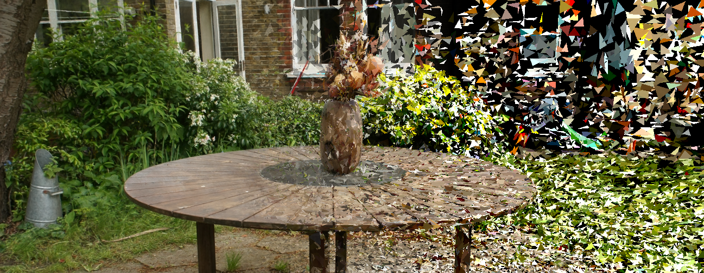

<h1 align="center">Triangle Splatting for Real-Time Radiance Field Rendering</h1>

<div align="center">
  <a href="https://trianglesplatting.github.io/">Project page</a> &nbsp;|&nbsp;
  <a href="https://arxiv.org/abs/2505.19175">Arxiv</a> &nbsp;|&nbsp;
</div>
<br>

<p align="center">
  Jan Held*, Renaud Vandeghen*, Adrien Deliege, Abdullah Hamdi, Silvio Giancola, Anthony Cioppa, Andrea Vedaldi, Bernard Ghanem, Andrea Tagliasacchi, Marc Van Droogenbroeck
</p>

<br>

<div align="center">
  
</div>


This repo contains the official implementation for the paper "Triangle Splatting for Real-Time Radiance Field Rendering". 

Our work represents a significant advancement in radiance field rendering by introducing 3D triangles as rendering primitive. By leveraging the same primitive used in classical mesh representations, our method bridges the gap between neural rendering and traditional graphics pipelines. Triangle Splatting offers a compelling alternative to volumetric and implicit methods, achieving high visual fidelity with faster rendering performance. These results establish Triangle Splatting as a promising step toward mesh-aware neural rendering, unifying decades of GPU-accelerated graphics with modern differentiable frameworks.

## Edits of this fork
This project took a while for me to get set up and running locally, and I'd like to make it easier to access for more people as well as further integrate into unreal as much as possible.  It is an extension of my video here:  https://www.youtube.com/video/vmpl0yR18jM
The loose goals of this branch as of forking are as follows:
1. Get the binaries building on the 5090 on ubuntu.  I was unable to get this working after a few hours of troubleshooting as ubuntu support for this GPU appears to be limited and incompatible with the combination of torch and cuda versions used by the original project, and I was unable to recompile torch for it.  I am also a linux noob tho which may just result in trying:
2. Get triangle splatting working on windows.  I mostly use windows so I'd probably be better off getting this working aside from the fact that I now have some runpods configured which seem like an easy way to scale as needed.
3. Create a custom file type that converts the .pt files into multi-frame mapped binaries unreal can load via a plugin I'm developing along side this project.  The goals for that are to support all rendering features via Unreal's experimental but built in order independent transparancy rendering mode.  This is unlikely to run in real time even with low splat counts, but we'll see!  Basic goal is to be able to use unreal as a 4d compositor.
4. Create blender import scripts for the above.

## Cloning the Repository + Installation

The code has been used and tested with Python 3.11 and CUDA 12.6.

You should clone the repository with the different submodules by running the following command:

```bash
git clone https://github.com/Joey-Wittmann/triangle-splatting-unreal --recursive
cd triangle-splatting
```

Then, we suggest to use a virtual environment to install the dependencies.

```bash
micromamba create -f requirements.yaml
```

Finally, you can compile the custom CUDA kernels by running the following command:

```bash
bash compile.sh
cd submodules/simple-knn
pip install .
```

## Training
To train our model, you can use the following command:
```bash
python train.py -s <path_to_scenes> -m <output_model_path> --eval
```

If you want to train the model on outdoor scenes, you should add the following command:  
```bash
python train.py -s <path_to_scenes> -m <output_model_path> --outdoor --eval
```

## Rendering
To render a scene, you can use the following command:
```bash
python render.py -m <path_to_model>
```

## Evaluation
To evaluate the model, you can use the following command:
```bash
python metrics.py -m <path_to_model>
```

## Video
To render a video, you can use the following command:
```bash
python create_video.py -m <path_to_model>
```

## Replication of the results
To replicate the results of our paper, you can use the following command:
```bash
python full_eval.py --output_path <output_path> -m360 <path_to_MipNeRF360> -tat <path_to_T&T>
```

## Game engine
To create your own .off file:

1. Train your scene using ```train_game_engine.py```. This version includes some modifications, such as pruning low-opacity triangles and applying an additional loss in the final training iterations to encourage higher opacity. This makes the result more compatible with how game engines render geometry. These modifications are experimental, so feel free to adjust them or try your own variants. (For example, increasing the normal loss often improves quality by making triangles better aligned and reducing black holes.)

2. Run ```create_off.py``` to convert the optimized triangles into a .off file that can be imported into a game engine. You only need to provide the path to the trained model (e.g., point_cloud_state_dict.pt) and specify the desired output file name (e.g., mesh_colored.off).

Note: The script generates fully opaque triangles. If you want to include per-triangle opacity, you can extract and activate the raw opacity values using:
```
opacity_raw = sd["opacity"]
opacity = torch.sigmoid(opacity_raw.view(-1))
opacity_uint8 = (opacity * 255).to(torch.uint8)
```
Each triangle has a single opacity value, so if needed, assign the same value to all three of its vertices when exporting with:
```
for i, face in enumerate(faces):
            r, g, b = colors[i].tolist()
            a = opacity_uint8[i].item()
            f.write(f"3 {face[0].item()} {face[1].item()} {face[2].item()} {r} {g} {b} {a}\n")
```

If you want to run some pretrained scene on a game engine for yourself, you can download the *Garden* and *Room* scenes from the [following link](https://drive.google.com/drive/folders/1_TMXEFTdEACpHHvsmc5UeZMM-cMgJ3xW?usp=sharing). 

## BibTeX
If you find our work interesting or use any part of it, please cite our paper:
```bibtex
@article{Held2025Triangle,
title = {Triangle Splatting for Real-Time Radiance Field Rendering},
author = {Held, Jan and Vandeghen, Renaud and Deliege, Adrien and Hamdi, Abdullah and Cioppa, Anthony and Giancola, Silvio and Vedaldi, Andrea and Ghanem, Bernard and Tagliasacchi, Andrea and Van Droogenbroeck, Marc},
journal = {arXiv},
year = {2025},
}
```

As Triangle Splatting builds heavily on top of 3D Convex Splatting, please also cite it.
```bibtex
@InProceedings{held20243d,
title={3D Convex Splatting: Radiance Field Rendering with 3D Smooth Convexes},
  author={Held, Jan and Vandeghen, Renaud and Hamdi, Abdullah and Deliege, Adrien and Cioppa, Anthony and Giancola, Silvio and Vedaldi, Andrea and Ghanem, Bernard and Van Droogenbroeck, Marc},
  booktitle = {Proceedings of the IEEE/CVF Conference on Computer Vision and Pattern Recognition (CVPR)},
  year = {2025},
}
```

## Acknowledgements
This project is built upon 3D Convex Splatting and 3D Gaussian Splatting. We want to thank the authors for their contributions.

J. Held and A. Cioppa are funded by the F.R.S.-FNRS. The research reported in this publication was supported by funding from KAUST Center of Excellence on GenAI, under award number 5940. This work was also supported by KAUST Ibn Rushd Postdoc Fellowship program. The present research benefited from computational resources made available on Lucia, the Tier-1 supercomputer of the Walloon Region, infrastructure funded by the Walloon Region under the grant agreement n°1910247.

